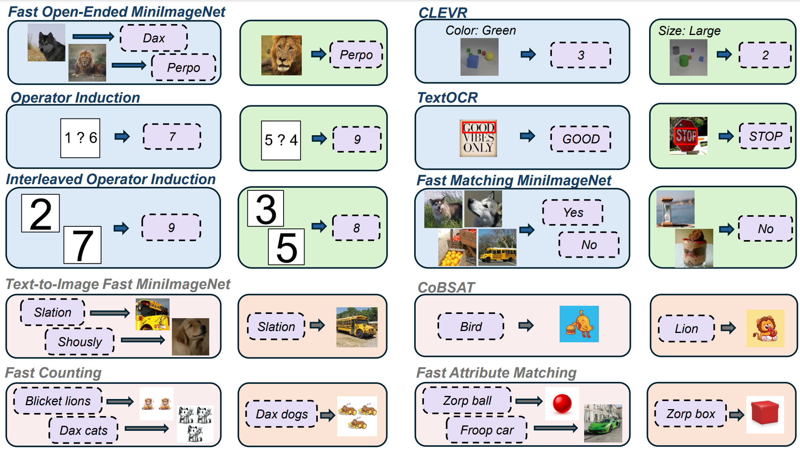

<div class="columns is-centered has-text-centered">
    <div class="column is-four-fifths">
        <h2>Abstract</h2>
        <div class="content has-text-justified">
Large language models (LLMs) famously exhibit emergent in-context learning (ICL) -- the ability to rapidly adapt to new tasks using few-shot examples provided as a prompt, without updating the model's weights. Built on top of LLMs, vision large language models (VLLMs) have advanced significantly in areas such as recognition, reasoning, and grounding. However, investigations into \emph{multimodal ICL} have predominantly focused on few-shot visual question answering (VQA), and image captioning, which we will show neither exploit the strengths of ICL, nor test its limitations. The broader capabilities and limitations of multimodal ICL remain under-explored. In this study, we introduce a comprehensive benchmark VL-ICL for multimodal in-context learning, encompassing a broad spectrum of tasks that involve both images and text as inputs and outputs, and different types of challenges, from {perception to reasoning and long context length}. We evaluate the abilities of state-of-the-art VLLMs against this benchmark suite, revealing their diverse strengths and weaknesses, and showing that even the most advanced models, such as GPT-4, find the tasks challenging. By highlighting a range of new ICL tasks, and the associated strengths and limitations of existing models, we hope that our dataset will inspire future work on enhancing the in-context learning capabilities of VLLMs, as well as inspire new applications that leverage VLLM ICL.
        </div>
    </div>
</div>

---




Figure: Illustration of the different tasks in \bench{}. Image-to-text tasks are in the first three rows, while text-to-image tasks are in the bottom row. Image-to-text tasks in the third row do reasoning on interleaved image-text inputs.


## Contributions
1. We demonstrate the limitations inherent in the common practice of quantitatively evaluating VLLM ICL via VQA and captioning. 
2. We introduce the first thorough and integrated benchmark suite of ICL tasks covering diverse challenges including perception, reasoning, rule-induction, long context-length and text-to-image/image-to-text.
3. We rigorously evaluate a range of state-of-the-art VLLMs on our benchmark suite, and highlight their diverse strengths and weaknesses, as well the varying maturity of solutions to different ICL challenges.

## VL-ICL Bench

Our VL-ICL Bench covers a number of tasks, which includes diverse ICL capabilities such as concept binding, reasoning or fine-grained perception. It covers both image-to-text and text-to-
image generation. Our benchmark includes the following eight tasks: Fast Open MiniImageNet, CLEVR Count Induction, Operator Induction, Interleaved Operator Induction, TextOCR, Matching
MiniImageNet, Text-to-image MiniImageNet and CoBSAT. 


Table: VL-ICL Bench overview. It evaluates diverse capabilities and challenges of ICL with VLLMs. Meanwhile it is compact and easy to be used by researchers, without prohibitive resource requirements.


## Results


The main results for VL-ICL Bench are presented in the figure above including a breakdown over shots. We make the following observations:
1. VLLMs demonstrate non-trivial in-context learning on VL-ICL Bench tasks. 
2. VLLMs often struggle to make use of a larger number of ICL examples. 
3. GPT4V is the best overall image-to-text model.
4. Zero-shot performance is not strongly indicative of ICL ability.
5. There is No clear winner among text-to-image models.


## Citation
```
@article{zong2024vlicl,
  title={VL-ICL Bench: The Devil in the Details of Benchmarking Multimodal In-Context Learning},
  author={Zong, Yongshuo and Bohdal, Ondrej and Hospedales Timothy},
  journal={arXiv},
  year={2024}
}
```
